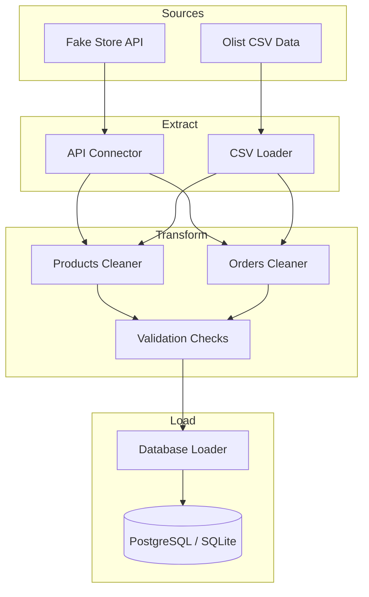

# 🚚 Data-Engineering-for-E-Commerce-Logistics

**E-Commerce Logistics Data Engineering Platform**

A production-ready ETL pipeline demonstrating Data Engineering skills for ingesting, cleaning, and storing e-commerce logistics data. Built with Python, Pandas, SQL, and Apache Airflow.

---

## 📋 Table of Contents

- [Overview](#overview)
- [Architecture](#architecture)
- [Tech Stack](#tech-stack)
- [Quick Start](#quick-start)
- [Project Structure](#project-structure)
- [Data Sources](#data-sources)
- [Pipeline Components](#pipeline-components)
- [Running the Pipeline](#running-the-pipeline)
- [Testing](#testing)

---

## 🎯 Overview

This project provides a complete ETL pipeline that demonstrates core data engineering patterns:

| Pattern | Implementation |
|---------|---------------|
| **Data Ingestion** | API calls with retry logic, CSV loading with chunking |
| **Data Cleaning** | Missing value handling, deduplication, timestamp standardization |
| **Data Validation** | Schema checks, null thresholds, business rule validation |
| **Data Loading** | SQL upserts, batch processing, transaction management |
| **Orchestration** | Airflow DAGs with parallel tasks and scheduling |

---

## 🏗️ Architecture



---

## 🛠️ Tech Stack

| Category | Technology |
|----------|------------|
| **Language** | Python 3.10+ |
| **Data Processing** | Pandas, NumPy |
| **Database** | SQLite (dev), PostgreSQL (prod) |
| **ORM** | SQLAlchemy |
| **Orchestration** | Apache Airflow |
| **Testing** | Pytest |
| **Code Quality** | Black, Ruff, MyPy |

---

## 🚀 Quick Start

### 1. Clone and Setup

```bash
# Clone the repository
cd Data-Engineering-for-E-Commerce-Logistics

# Create virtual environment
python -m venv venv
source venv/bin/activate  # Linux/Mac
# or: venv\Scripts\activate  # Windows

# Install dependencies
pip install -r requirements.txt
```

### 2. Run the Pipeline

```bash
# Run with API data source (default)
python -m src.main --source api

# Run with Olist CSV data
python -m src.main --source csv

# Run with both sources
python -m src.main --source both
```

### 3. Check Results

```bash
# Open SQLite database
sqlite3 data/logiflow.db

# Query loaded data
SELECT COUNT(*) FROM products;
SELECT COUNT(*) FROM orders;
SELECT * FROM v_order_summary LIMIT 5;
```

---

## 📁 Project Structure

```
Data-Engineering-for-E-Commerce-Logistics/
├── README.md
├── requirements.txt
├── config/
│   └── config.yaml              # Central configuration
├── src/
│   ├── __init__.py
│   ├── main.py                  # Pipeline orchestrator
│   ├── extract/
│   │   ├── api_connector.py     # Fake Store API client
│   │   └── csv_loader.py        # Olist CSV loader
│   ├── transform/
│   │   ├── cleaners.py          # Data cleaning logic
│   │   └── validators.py        # Data quality checks
│   ├── load/
│   │   ├── schema.sql           # Database DDL
│   │   └── db_loader.py         # SQL loading logic
│   └── utils/
│       ├── config.py            # Config management
│       └── logger.py            # Logging utilities
├── dags/
│   └── etl_pipeline_dag.py      # Airflow DAG
├── data/
│   ├── raw/                     # Raw extracted data
│   └── processed/               # Cleaned data
└── tests/
    ├── test_extract.py
    ├── test_transform.py
    └── test_load.py
```

---

## 📊 Data Sources

### 1. Fake Store API (Real-time)

Free e-commerce API providing:
- **Products**: Catalog with prices, categories, ratings
- **Carts**: Shopping carts (simulates orders)
- **Users**: Customer information

```python
from src.extract.api_connector import APIConnector

connector = APIConnector()
products = connector.fetch_products()
orders = connector.fetch_carts()
```

### 2. Olist Brazilian E-Commerce (Historical)

Real-world dataset from Kaggle with:
- 100k+ orders from 2016-2018
- Delivery timestamps and durations
- Customer and seller locations
- Payment and review data

Download from: [Kaggle Olist Dataset](https://www.kaggle.com/datasets/olistbr/brazilian-ecommerce)

Place files in: `data/raw/olist/`

---

## ⚙️ Pipeline Components

### Extract Layer

```python
# API extraction with retry
from src.extract.api_connector import APIConnector

connector = APIConnector()
connector.fetch_all(save_raw=True)
```

Features:
- ✅ Exponential backoff retry
- ✅ Rate limiting
- ✅ Response validation
- ✅ Metadata enrichment

### Transform Layer

```python
# Data cleaning
from src.transform.cleaners import OrdersCleaner

cleaner = OrdersCleaner()
cleaned_df = cleaner.clean(raw_df)
```

Features:
- ✅ Missing value handling (drop/fill/interpolate)
- ✅ Duplicate removal
- ✅ Timestamp standardization
- ✅ Derived metrics (delivery_duration_hours)

### Validate Layer

```python
# Data quality checks
from src.transform.validators import create_orders_validator

validator = create_orders_validator()
report = validator.validate(df)
print(f"Passed: {report.passed}")
```

Features:
- ✅ Null percentage thresholds
- ✅ Schema validation
- ✅ Uniqueness constraints
- ✅ Custom business rules

### Load Layer

```python
# Database loading with upsert
from src.load.db_loader import DatabaseLoader

loader = DatabaseLoader(db_type="sqlite")
loader.initialize_schema()
loader.load_orders(orders_df)
```

Features:
- ✅ Upsert logic (INSERT ON CONFLICT UPDATE)
- ✅ Batch processing
- ✅ Transaction management
- ✅ ETL run logging

---

## 🔧 Running the Pipeline

### CLI Options

```bash
# View help
python -m src.main --help

# Run with API source (default)
python -m src.main --source api

# Run with PostgreSQL
python -m src.main --db postgresql

# Skip validation
python -m src.main --no-validate
```

### Airflow (Scheduled)

Since this project uses a local virtual environment for better dependency management, follow these steps to run Airflow:

```bash
# 1. Activate virtual environment
source venv/bin/activate

# 2. Set environment variables (Run from project root)
export AIRFLOW_HOME=$(pwd)
export PYTHONPATH=$(pwd)

# 3. Initialize/Migrate Airflow Database (only need to run once)
airflow db migrate

# 4. Create Admin User (for webserver access)
airflow users create \
    --username admin \
    --firstname Admin \
    --lastname User \
    --role Admin \
    --email admin@example.com \
    --password admin

# 5. Run the DAG manually (Testing)
# This executes the DAG immediately without a scheduler
airflow dags test logiflow_etl_pipeline 2026-01-01

# 6. Start Full Airflow System (Scheduler + Webserver)
# Run in separate terminals
airflow scheduler
airflow webserver -p 8080
```

---

## 🧪 Testing

```bash
# Run all tests
pytest tests/ -v

# Run with coverage
pytest tests/ --cov=src --cov-report=html

# Run specific test file
pytest tests/test_transform.py -v
```

---

## 📝 License

MIT License 
---

## 🤝 Acknowledgments

- [Fake Store API](https://fakestoreapi.com/) - Free e-commerce API
- [Olist Dataset](https://www.kaggle.com/datasets/olistbr/brazilian-ecommerce) - Real-world e-commerce data
